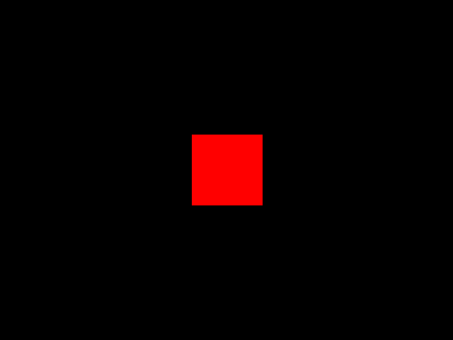
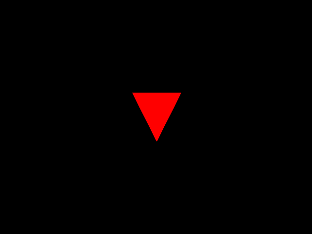

# 🎮 3D Shapes Renderer using Verilog

> **Want to generate shapes like squares, circles, or even 3D cubes using only Verilog?** This project brings geometric imagination to life by creating shapes directly on a display — all powered by a custom-designed GPU architecture in RTL!

---

## 🧠 Overview

This repository is a complete RTL-based 2D/3D shape renderer built in Verilog. It simulates how graphical processing works from the ground up — without using any external graphics engine.

Using modules like a framebuffer, processor core, shape logic, and a horizontal/vertical sync generator, you can display shapes such as:

-  **SQUARE**
-  **TRIANGLE**
-  **CIRCLE**
-  **CUBE**
-  **CUBOID**
-  **PRISM**

This project simulates pixel-level drawing using memory-mapped processing — and outputs `.bmp` images as the final result.

---

## 🛠️ How It Works

### 🧠 `core`
Contains the brain of the rendering system — including memory management, GPU logic, processor, and framebuffer.

### 🌀 `sync`
Handles VGA timing via horizontal and vertical sync generation.

### 🎨 `shapes`
Each folder corresponds to a unique shape drawing logic and instruction.

### 🖼️ `IMAGES`
Stores rendered BMP outputs for visual verification.

---

🧠 What You’ll Learn
- How to build a minimal GPU architecture
- Framebuffer handling in Verilog
- VGA timing and rendering logic
- How raster images are formed at hardware level
- Instruction-based shape rendering with memory-mapped architecture

## 🖼️ Output Gallery

Below are examples of what this engine can generate (located in the `IMAGES/` folder):

| Shape    | Preview                        |
|----------|--------------------------------|
| Square   |        |
| Triangle |      |
| Circle   |        |
| Cube     |          |
| Cuboid   |        |
| Prism    |         |

---

## 🚀 Getting Started

### 🧰 Requirements

- 🐧 Linux or WSL (Windows Subsystem for Linux)
- 📦 [Verilator](https://verilator.org/)
- 💻 C++ compiler (like `g++`)

### ⚙️ Compilation (Using Makefile)

To compile and run the simulation:

```bash
make           # Builds the project using Verilator
./sim          # Runs the simulation
make clean
```

## ✍️ Author
- Developed by Hilay Patel
- 🎓 Electrical Engineering | 🏫 IIT Tirupati
- 📬 For queries, open an issue or discussion on the repo!
